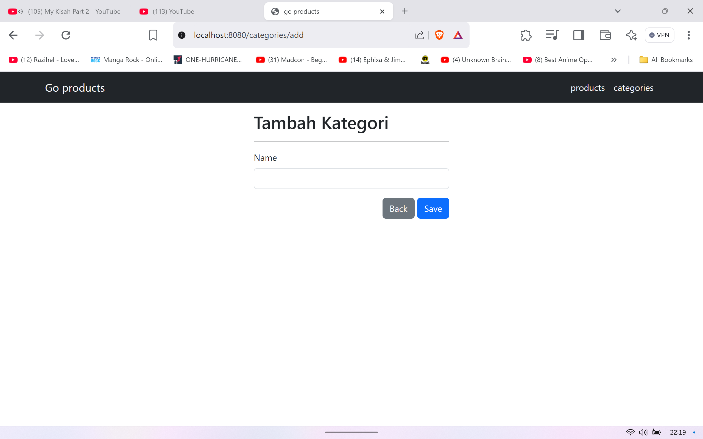
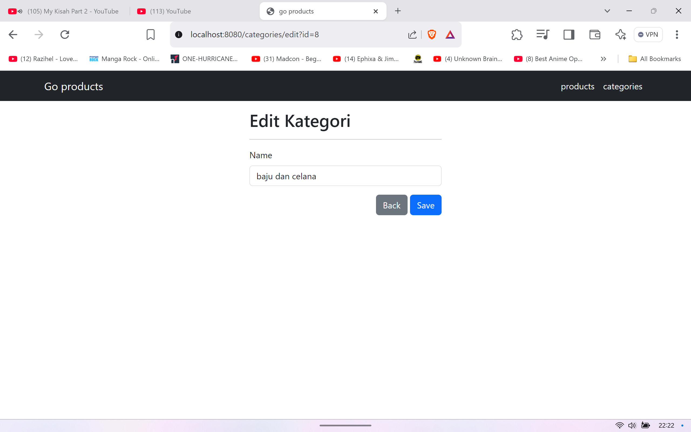
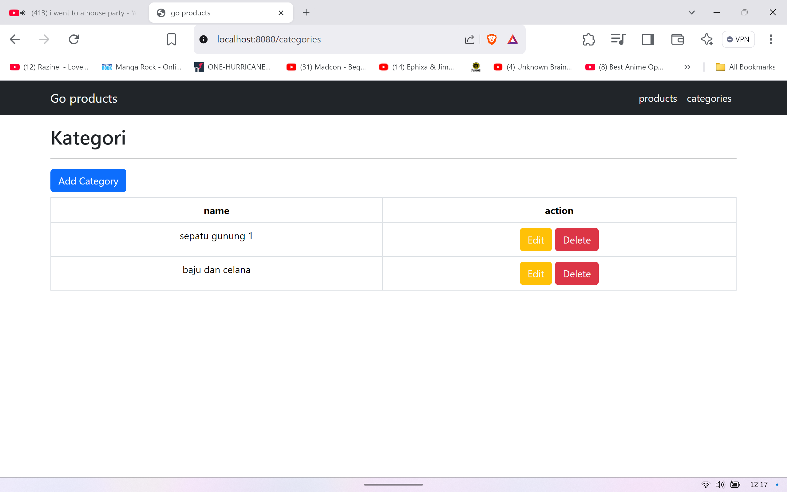
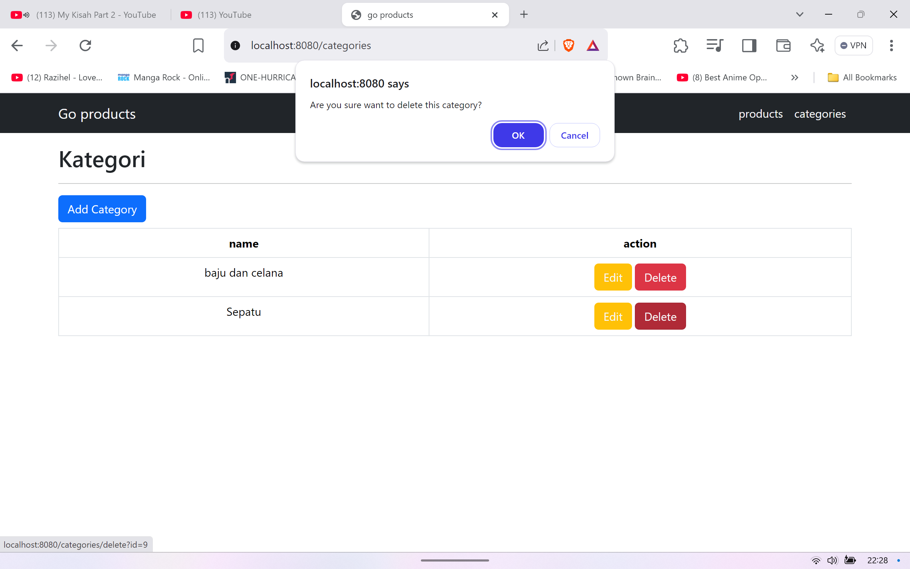
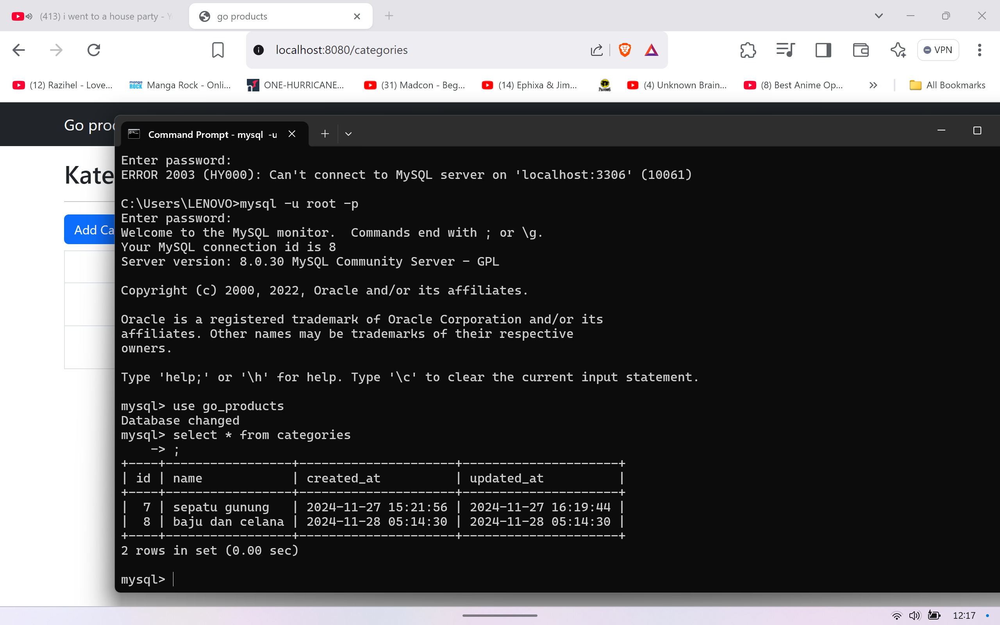
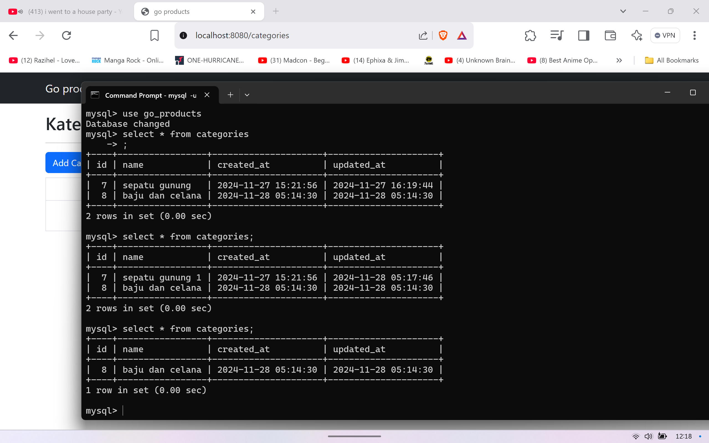

# easgopbkkcrud
## 24/11/2024 setting UI home dan database
membuat UI dan konfigurasi database sehingga web dapat mengakses database
 
 

 
 

## 25/11/2024 setting UI untuk bagian kategori
membuat ui untuk page kategori
 
 

## 26/11/2024 configurasi CRUD untuk bagian kategori
mengonfigurasi CRUD sehingga page kategori dapat melakukan perintah CRUD
 
 

 
 

 
 

 
 

 
 

 
 

 
 

